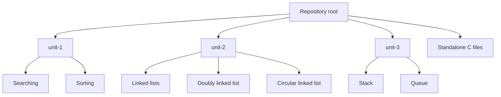
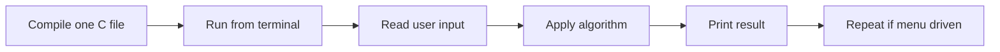

# Data Structures and Algorithms with C

This is my C practice repo for core data structures and algorithms. It is organized like a lab notebook: small programs, each focused on one concept, with direct terminal input and output.

## What is inside

| Area | Examples |
|---|---|
| Searching | Linear search, binary search |
| Sorting | Bubble, insertion, selection, merge, quick |
| Linked lists | Singly, doubly, circular linked list operations |
| Stack and queue | Menu driven stack and queue programs |
| Extra practice | Reverse logic, postfix style exercises, small standalone files |

## Folder map



## Program flow

Most files follow the same simple pattern:



## Compile and run

For a single file:

```bash
clang unit-1/search/binary.c -o binary
./binary
```

Or with GCC:

```bash
gcc unit-3/stack.c -o stack
./stack
```

The repo also has a `Makefile`:

```bash
make
./main
```

## Notes from me

This repo is meant for practice and revision. The programs are intentionally direct, with `scanf`, menus, and printed output, because the goal is to understand the algorithm before wrapping it in abstractions.

## Topics covered

- Arrays
- Searching
- Sorting
- Pointers
- Dynamic memory
- Linked lists
- Stacks
- Queues
- Menu driven C programs
